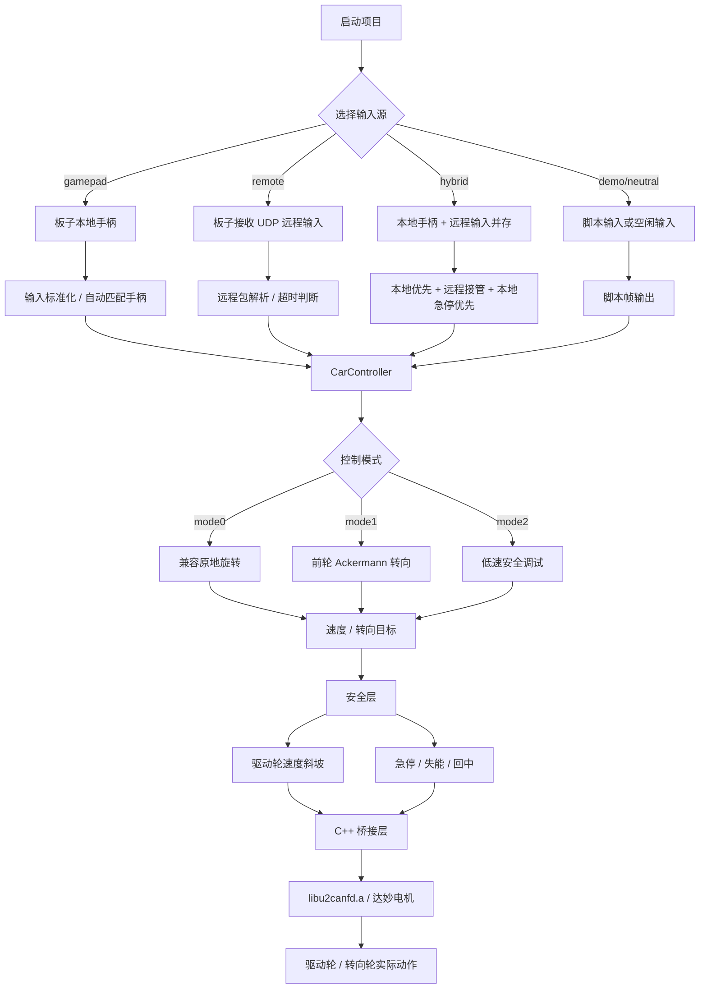

# 项目流程图



## 校准流程

```text
硬件连通 -> scripts/calibrate_hardware.py --verify
          -> scripts/calibrate_hardware.py --calibrate-drive
          -> scripts/calibrate_hardware.py --calibrate-steer --save-flash
          -> 保存 configs/hardware.local.json
          -> 真机验证
```

## 现在还值得继续优化的点

1. 自动生成更完整的现场报告
   - 把 `--verify` 的结果输出成一份可保存的校准报告

2. 驱动方向确认再自动化一点
   - 现在已经能点动和记录，但“正向是否推车前进”仍要人工看

3. 零点校准做成独立命令
   - 现在在向导里能做，后面可以单独拆成 `--set-zero`

4. 远程输入加确认机制
   - 可以考虑增加可选 ACK / 心跳摘要，方便看丢包和延迟

5. 现场调参文件分层
   - 把“固定硬件参数”和“现场临时参数”彻底分开，减少误改

6. 真机诊断回显再细一点
   - 增加每个轮子的目标值、实测值、误差值

7. 车身尺寸自检
   - 轴距、轮距、减速比合法性已经能查，还可以加范围提示

